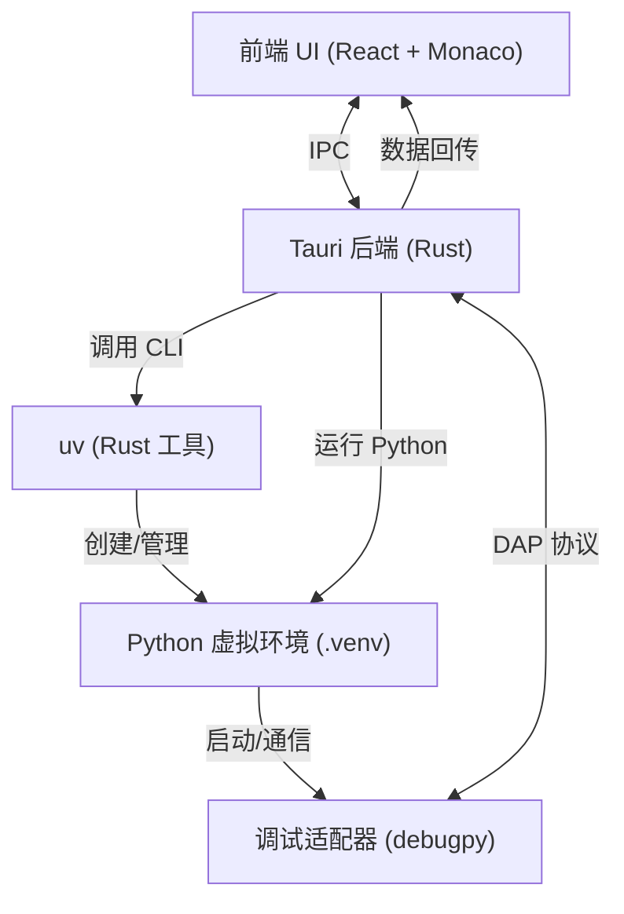

# Pyra IDE 项目设计文档

## 1. 项目概述
本项目旨在基于 **Tauri (Rust)** 跨平台框架，重新实现一个轻量级 Python IDE。
与传统 IDE (如 Thonny、PyCharm) 不同，本项目强调：
- **轻量化**：整体体积小，启动快。
- **现代化**：底层以 Rust 为主，利用 `uv` 统一管理 Python 解释器、虚拟环境与依赖。
- **跨平台**：支持 Windows / macOS / Linux。
- **可扩展性**：支持插件机制、语法分析与调试扩展。

---

## 2. 技术栈

### 前端 (UI 层)
- **框架**：React (TypeScript)
- **代码编辑器**：Monaco Editor
- **UI 库**：TailwindCSS + Radix UI
- **功能模块**：
  - 文件树浏览器
  - 编辑器 (语法高亮、智能提示)
  - 控制台 (stdout/stderr 实时输出)
  - 调试面板 (断点、变量、堆栈)
  - 设置面板 (环境/依赖管理)

### 桌面应用壳
- **框架**：Tauri
- **职责**：
  - 提供跨平台桌面环境
  - 管理窗口与前后端通信 (IPC)
  - 自动更新与安全隔离

### 后端 (核心服务 - Rust)
- **语言**：Rust
- **主要依赖 (crates)**：
  - `tokio` (异步运行时)
  - `serde/serde_json` (配置解析)
  - `anyhow` (错误处理)
  - `tree-sitter` (语法分析)
  - `tower-lsp` (可选，LSP 实现)
- **功能模块**：
  - 文件系统操作
  - 进程管理 (运行 Python 脚本)
  - 调用 `uv` 管理 Python 版本 / 虚拟环境 / 依赖
  - 调试管理 (DAP 客户端)
  - 插件系统 (Rust API + 前端扩展点)
  - 静态分析与格式化 (调用 `ruff`)

### Python 运行时 (由 uv 管理)
- **解释器**：由 `uv` 下载与安装的指定版本 Python
- **虚拟环境**：`.venv`，由 `uv venv` 创建
- **调试工具**：`debugpy`（安装在 venv 中，用于 DAP 调试）
- **依赖管理**：`uv pip install ...`

---

## 3. 环境管理工具：uv
- **uv 功能**：
  - 管理 Python 版本 (`uv python install 3.12`)
  - 创建虚拟环境 (`uv venv .venv`)
  - 安装依赖 (`uv pip install requests`)
  - 快速、跨平台、Rust 实现，性能优越
- **在 IDE 中的作用**：
  - Rust 后端调用 `uv` CLI
  - 统一 Python 解释器与依赖的来源
  - 避免依赖系统自带的 `python/pip`

---

## 4. 系统架构

---

## 5. 功能模块设计

### 5.1 项目管理
- 新建项目 / 打开项目
- 自动生成 `.venv`（使用 uv）
- `pyproject.toml` / `requirements.txt` 解析

### 5.2 编辑器
- Monaco Editor
- 支持 Python 语法高亮、自动补全
- 集成 `ruff` 静态分析

### 5.3 运行与调试
- 后端调用 `.venv/bin/python` 启动脚本
- 输出流式转发到前端控制台
- 调试模式下，先启动 `debugpy`
- Rust 后端实现 DAP 客户端，转发调试事件到前端

### 5.4 包管理
- 安装/卸载 Python 包 (`uv pip install/uninstall`)
- 自动同步依赖到 `pyproject.toml` 或 `requirements.txt`
- 显示依赖树

### 5.5 插件机制
- 前端插件：React 组件扩展
- 后端插件：Rust 模块 API
- 插件访问能力受限（需显式声明）

---

## 6. 关键设计原则
1. **Rust 优先**：所有底层功能用 Rust 实现，不依赖 Python。
2. **uv 驱动**：所有 Python 相关功能交给 uv 管理，避免用户自行配置。
3. **模块化**：编辑器 / 调试 / 包管理 / 插件系统解耦。
4. **跨平台一致性**：Windows/macOS/Linux 一致体验。
5. **轻量化**：安装体积小、启动快。

---

## 7. 开发路线 (Milestones)

1. **MVP**
   - 编辑器 (Monaco)
   - 调用 uv 创建 venv
   - 运行 Python 脚本
   - 控制台输出

2. **基础 IDE**
   - 包管理 (uv pip)
   - 依赖可视化
   - ruff 集成 (lint/format)

3. **调试支持**
   - 集成 debugpy
   - Rust 实现 DAP 客户端
   - 前端调试面板

4. **插件机制**
   - 前端扩展点
   - 后端 Rust 插件 API

5. **优化与打包**
   - 跨平台打包
   - 自动更新
   - UI/UX 打磨

---

## 8. IDE 命名
候选：
- **Pyra**（推荐，现代、简洁，含 Py 与火焰/塔意象）
- **Taipy**（Tauri + Python）
- **Lumino**（启蒙/照亮学习）
- **Serpy**（轻快，适合教育）

👉 首选推荐：**Pyra**
